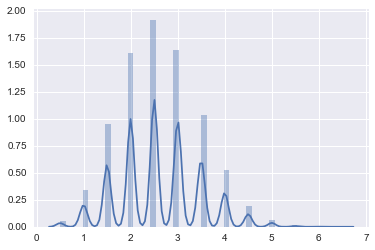
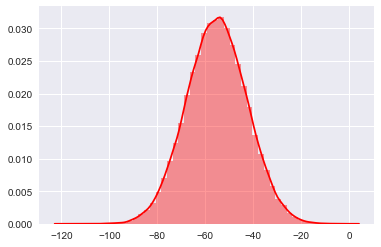
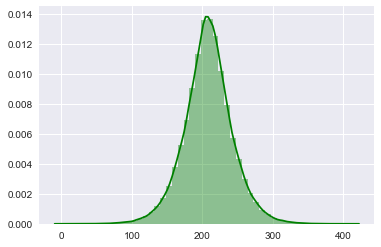
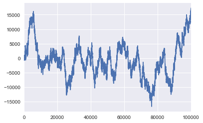

```python
import numpy as np
import scipy
import pandas as pd
import matplotlib.pyplot as plt
import seaborn as sns
%matplotlib inline

```

## Random Market Trade Generator, batch of trades


```python
sns.set()
spread = 0 #Assume Spread In Pips
```

### Simulation Size


```python
SimSize = 100000
```

#### Pip Range base area


```python
base = 50
```

#### Random Generators


```python
randomtrades = np.random.randint(0,high=2,size=SimSize)

tradeid = range(SimSize,SimSize*2)

PipModifier = (np.random.normal(size=SimSize))
```

### Risk Reward Simulation
    Assume that the average Risk Reward is at least 2 ( like a typical Trader would try and filter by)


```python
RiskReward =  np.random.binomial(n = 14, p = 0.3,size=SimSize)
# I intended to make it a max of RR 7, I use 14 where I will divide by 2 later as a float to get a intervals of 0.5
RiskReward = (RiskReward + 1)/2. # Gets rid of 0 and makes it a float too.
```

#### Check the min and average


```python
print np.min(RiskReward),np.mean(RiskReward)
```

    0.5 2.60035
    

#### Logically you should expect the Risk Reward to be a binomial distribution such as this, 
    based on market volatility, the skew should be towards the left, as I've placed the parameter p = 0.3


```python
sns.distplot(RiskReward)
plt.show()
```





#### Headers and inferences


```python
Header = [ 'TradeId','Direction','Size','SLPips', 'TPPips', 'OutcomePips','Outcome$', 'AccumulativeOutcomePips', 'AccumulativeOutcome']
```


```python
sizerange = [ 0.1 for i in range(SimSize)]
Direction = ['Buy' if direction == 1 else 'Sell' for direction in randomtrades ]
```

### SL
 The distribution generates including negative numbers so we have to do a mathematical perturbation.
     We'll do that by simply adding the abs of the minimum amount.
         This way, the lowest value will become 0. However, the numbers are all inflated.
         We will then have to divide it by the amount it was inflated by


```python
def GenSL(base=base, PipModifier=PipModifier):
    first = (base *PipModifier) # The normal distribution but with negative values and positive value
    minamt = abs(np.min(first)) # Amount to shift it by
    ratio = minamt/base # Amount that it was inflated by
    output = (first + minamt ) /4
    return output*-1 #output should be negative for SL


```

#### Same transformation for TP, except Tp is multiplied with Risk : Reward Ratio as a multiplier


```python
def GenTP(base=base, PipModifier=PipModifier, RiskReward=RiskReward):
    first = (base *PipModifier) * RiskReward # The normal distribution but with negative values and positive value
    minamt = abs(np.min(first)) # Amount to shift it by
    ratio = minamt/base # Amount that it was inflated by
    
    return (first + minamt ) /4
    

```


```python
sns.distplot(GenSL(),bins=50, color = 'r')
plt.show()

```





```python
sns.distplot(GenTP(),bins=50, color = 'g')
plt.show()
```





### Create the TP and SL array


```python
TPPips = GenTP()
SLPips = GenSL()
```

#### Win/Loss based on Efficient Market Hypothesis

####    Calculate Probability to Win on Random


```python
def Prob(TP,SL):
    Total = TP + abs(SL)
    pb = abs(SL) / Total
    return pb
```


```python
WinLoss = [ 1 if np.random.random() < Prob(TP,SL) else 0 for TP, SL in zip(TPPips,SLPips)]
```

### Get the Outcome, Pips
    Since this is going to be in a large loop, we'll produce it via a list comprehension


```python
OutcomePips = [TPPips[index] -spread if win==1 else SLPips[index] for index,win in enumerate(WinLoss)]
```

#####  Accumulative Outcome Pips
    Accumulative Pips is a step by step iterative accumulative code so a classic for loop will do


```python
AccumulativePips =[]
Totalpips =0
for index,pips in enumerate(OutcomePips):
        Totalpips += pips
        AccumulativePips.append(Totalpips)

```


```python
data = [ tradeid, Direction, SLPips, TPPips, WinLoss,OutcomePips,AccumulativePips]
```

### Create the Panda Dataframe


```python
Tradehistory = pd.DataFrame( {'TradeId': tradeid, 'Direction':Direction, 'SLPips':SLPips, 'TPPips':TPPips, 'WinLoss':WinLoss, 'ResultPips':OutcomePips,'PipP&L':AccumulativePips})
```


```python
Tradehistory
```


<div>
<style>
    .dataframe thead tr:only-child th {
        text-align: right;
    }

    .dataframe thead th {
        text-align: left;
    }

    .dataframe tbody tr th {
        vertical-align: top;
    }
</style>
<table border="1" class="dataframe">
  <thead>
    <tr style="text-align: right;">
      <th></th>
      <th>Direction</th>
      <th>PipP&amp;L</th>
      <th>ResultPips</th>
      <th>SLPips</th>
      <th>TPPips</th>
      <th>TradeId</th>
      <th>WinLoss</th>
    </tr>
  </thead>
  <tbody>
    <tr>
      <th>0</th>
      <td>Buy</td>
      <td>227.475250</td>
      <td>227.475250</td>
      <td>-64.979820</td>
      <td>227.475250</td>
      <td>100000</td>
      <td>1</td>
    </tr>
    <tr>
      <th>1</th>
      <td>Sell</td>
      <td>152.450761</td>
      <td>-75.024489</td>
      <td>-75.024489</td>
      <td>277.161225</td>
      <td>100001</td>
      <td>0</td>
    </tr>
    <tr>
      <th>2</th>
      <td>Buy</td>
      <td>72.055682</td>
      <td>-80.395079</td>
      <td>-80.395079</td>
      <td>295.958290</td>
      <td>100002</td>
      <td>0</td>
    </tr>
    <tr>
      <th>3</th>
      <td>Sell</td>
      <td>26.886834</td>
      <td>-45.168848</td>
      <td>-45.168848</td>
      <td>167.604208</td>
      <td>100003</td>
      <td>0</td>
    </tr>
    <tr>
      <th>4</th>
      <td>Sell</td>
      <td>-20.804392</td>
      <td>-47.691226</td>
      <td>-47.691226</td>
      <td>189.096976</td>
      <td>100004</td>
      <td>0</td>
    </tr>
    <tr>
      <th>5</th>
      <td>Buy</td>
      <td>-48.693098</td>
      <td>-27.888706</td>
      <td>-27.888706</td>
      <td>112.185986</td>
      <td>100005</td>
      <td>0</td>
    </tr>
    <tr>
      <th>6</th>
      <td>Buy</td>
      <td>-110.667076</td>
      <td>-61.973978</td>
      <td>-61.973978</td>
      <td>218.123275</td>
      <td>100006</td>
      <td>0</td>
    </tr>
    <tr>
      <th>7</th>
      <td>Sell</td>
      <td>105.780599</td>
      <td>216.447674</td>
      <td>-58.075154</td>
      <td>216.447674</td>
      <td>100007</td>
      <td>1</td>
    </tr>
    <tr>
      <th>8</th>
      <td>Buy</td>
      <td>48.406640</td>
      <td>-57.373959</td>
      <td>-57.373959</td>
      <td>210.182965</td>
      <td>100008</td>
      <td>0</td>
    </tr>
    <tr>
      <th>9</th>
      <td>Sell</td>
      <td>-4.155811</td>
      <td>-52.562451</td>
      <td>-52.562451</td>
      <td>198.544093</td>
      <td>100009</td>
      <td>0</td>
    </tr>
    <tr>
      <th>10</th>
      <td>Sell</td>
      <td>-64.708452</td>
      <td>-60.552641</td>
      <td>-60.552641</td>
      <td>231.769001</td>
      <td>100010</td>
      <td>0</td>
    </tr>
    <tr>
      <th>11</th>
      <td>Sell</td>
      <td>-107.369762</td>
      <td>-42.661311</td>
      <td>-42.661311</td>
      <td>189.154274</td>
      <td>100011</td>
      <td>0</td>
    </tr>
    <tr>
      <th>12</th>
      <td>Sell</td>
      <td>-172.440583</td>
      <td>-65.070820</td>
      <td>-65.070820</td>
      <td>237.434674</td>
      <td>100012</td>
      <td>0</td>
    </tr>
    <tr>
      <th>13</th>
      <td>Buy</td>
      <td>-235.751204</td>
      <td>-63.310621</td>
      <td>-63.310621</td>
      <td>220.128240</td>
      <td>100013</td>
      <td>0</td>
    </tr>
    <tr>
      <th>14</th>
      <td>Buy</td>
      <td>-17.244955</td>
      <td>218.506249</td>
      <td>-60.495320</td>
      <td>218.506249</td>
      <td>100014</td>
      <td>1</td>
    </tr>
    <tr>
      <th>15</th>
      <td>Buy</td>
      <td>-72.993676</td>
      <td>-55.748721</td>
      <td>-55.748721</td>
      <td>209.696037</td>
      <td>100015</td>
      <td>0</td>
    </tr>
    <tr>
      <th>16</th>
      <td>Buy</td>
      <td>-129.647233</td>
      <td>-56.653557</td>
      <td>-56.653557</td>
      <td>212.862964</td>
      <td>100016</td>
      <td>0</td>
    </tr>
    <tr>
      <th>17</th>
      <td>Buy</td>
      <td>-146.388342</td>
      <td>-16.741109</td>
      <td>-16.741109</td>
      <td>92.445539</td>
      <td>100017</td>
      <td>0</td>
    </tr>
    <tr>
      <th>18</th>
      <td>Sell</td>
      <td>-200.151292</td>
      <td>-53.762951</td>
      <td>-53.762951</td>
      <td>205.806734</td>
      <td>100018</td>
      <td>0</td>
    </tr>
    <tr>
      <th>19</th>
      <td>Sell</td>
      <td>-267.387836</td>
      <td>-67.236543</td>
      <td>-67.236543</td>
      <td>243.931843</td>
      <td>100019</td>
      <td>0</td>
    </tr>
    <tr>
      <th>20</th>
      <td>Sell</td>
      <td>-325.763639</td>
      <td>-58.375803</td>
      <td>-58.375803</td>
      <td>215.808419</td>
      <td>100020</td>
      <td>0</td>
    </tr>
    <tr>
      <th>21</th>
      <td>Buy</td>
      <td>-364.654439</td>
      <td>-38.890800</td>
      <td>-38.890800</td>
      <td>191.699807</td>
      <td>100021</td>
      <td>0</td>
    </tr>
    <tr>
      <th>22</th>
      <td>Sell</td>
      <td>-434.593362</td>
      <td>-69.938923</td>
      <td>-69.938923</td>
      <td>274.007270</td>
      <td>100022</td>
      <td>0</td>
    </tr>
    <tr>
      <th>23</th>
      <td>Buy</td>
      <td>-476.937072</td>
      <td>-42.343711</td>
      <td>-42.343711</td>
      <td>169.253345</td>
      <td>100023</td>
      <td>0</td>
    </tr>
    <tr>
      <th>24</th>
      <td>Sell</td>
      <td>-532.785022</td>
      <td>-55.847950</td>
      <td>-55.847950</td>
      <td>209.766062</td>
      <td>100024</td>
      <td>0</td>
    </tr>
    <tr>
      <th>25</th>
      <td>Buy</td>
      <td>-597.804277</td>
      <td>-65.019255</td>
      <td>-65.019255</td>
      <td>242.142906</td>
      <td>100025</td>
      <td>0</td>
    </tr>
    <tr>
      <th>26</th>
      <td>Buy</td>
      <td>-654.063179</td>
      <td>-56.258902</td>
      <td>-56.258902</td>
      <td>210.998920</td>
      <td>100026</td>
      <td>0</td>
    </tr>
    <tr>
      <th>27</th>
      <td>Buy</td>
      <td>-449.221278</td>
      <td>204.841901</td>
      <td>-53.989196</td>
      <td>204.841901</td>
      <td>100027</td>
      <td>1</td>
    </tr>
    <tr>
      <th>28</th>
      <td>Sell</td>
      <td>-523.574188</td>
      <td>-74.352911</td>
      <td>-74.352911</td>
      <td>265.280945</td>
      <td>100028</td>
      <td>0</td>
    </tr>
    <tr>
      <th>29</th>
      <td>Buy</td>
      <td>-568.342483</td>
      <td>-44.768295</td>
      <td>-44.768295</td>
      <td>192.314750</td>
      <td>100029</td>
      <td>0</td>
    </tr>
    <tr>
      <th>...</th>
      <td>...</td>
      <td>...</td>
      <td>...</td>
      <td>...</td>
      <td>...</td>
      <td>...</td>
      <td>...</td>
    </tr>
    <tr>
      <th>99970</th>
      <td>Sell</td>
      <td>16129.466956</td>
      <td>-45.894166</td>
      <td>-45.894166</td>
      <td>179.904710</td>
      <td>199970</td>
      <td>0</td>
    </tr>
    <tr>
      <th>99971</th>
      <td>Sell</td>
      <td>16059.938494</td>
      <td>-69.528462</td>
      <td>-69.528462</td>
      <td>236.572534</td>
      <td>199971</td>
      <td>0</td>
    </tr>
    <tr>
      <th>99972</th>
      <td>Sell</td>
      <td>15994.415308</td>
      <td>-65.523186</td>
      <td>-65.523186</td>
      <td>233.676876</td>
      <td>199972</td>
      <td>0</td>
    </tr>
    <tr>
      <th>99973</th>
      <td>Sell</td>
      <td>15956.083839</td>
      <td>-38.331469</td>
      <td>-38.331469</td>
      <td>148.735656</td>
      <td>199973</td>
      <td>0</td>
    </tr>
    <tr>
      <th>99974</th>
      <td>Sell</td>
      <td>15921.753577</td>
      <td>-34.330262</td>
      <td>-34.330262</td>
      <td>145.212998</td>
      <td>199974</td>
      <td>0</td>
    </tr>
    <tr>
      <th>99975</th>
      <td>Sell</td>
      <td>15858.064074</td>
      <td>-63.689503</td>
      <td>-63.689503</td>
      <td>224.894616</td>
      <td>199975</td>
      <td>0</td>
    </tr>
    <tr>
      <th>99976</th>
      <td>Sell</td>
      <td>15802.677835</td>
      <td>-55.386240</td>
      <td>-55.386240</td>
      <td>208.380932</td>
      <td>199976</td>
      <td>0</td>
    </tr>
    <tr>
      <th>99977</th>
      <td>Buy</td>
      <td>16001.972741</td>
      <td>199.294907</td>
      <td>-52.357565</td>
      <td>199.294907</td>
      <td>199977</td>
      <td>1</td>
    </tr>
    <tr>
      <th>99978</th>
      <td>Sell</td>
      <td>15931.069102</td>
      <td>-70.903639</td>
      <td>-70.903639</td>
      <td>239.322888</td>
      <td>199978</td>
      <td>0</td>
    </tr>
    <tr>
      <th>99979</th>
      <td>Sell</td>
      <td>15879.592734</td>
      <td>-51.476368</td>
      <td>-51.476368</td>
      <td>200.468346</td>
      <td>199979</td>
      <td>0</td>
    </tr>
    <tr>
      <th>99980</th>
      <td>Sell</td>
      <td>16097.347237</td>
      <td>217.754503</td>
      <td>-59.154237</td>
      <td>217.754503</td>
      <td>199980</td>
      <td>1</td>
    </tr>
    <tr>
      <th>99981</th>
      <td>Buy</td>
      <td>16055.746008</td>
      <td>-41.601229</td>
      <td>-41.601229</td>
      <td>167.025900</td>
      <td>199981</td>
      <td>0</td>
    </tr>
    <tr>
      <th>99982</th>
      <td>Sell</td>
      <td>16007.710736</td>
      <td>-48.035272</td>
      <td>-48.035272</td>
      <td>193.586153</td>
      <td>199982</td>
      <td>0</td>
    </tr>
    <tr>
      <th>99983</th>
      <td>Buy</td>
      <td>15940.329676</td>
      <td>-67.381061</td>
      <td>-67.381061</td>
      <td>238.321563</td>
      <td>199983</td>
      <td>0</td>
    </tr>
    <tr>
      <th>99984</th>
      <td>Buy</td>
      <td>16137.220020</td>
      <td>196.890345</td>
      <td>-51.556044</td>
      <td>196.890345</td>
      <td>199984</td>
      <td>1</td>
    </tr>
    <tr>
      <th>99985</th>
      <td>Sell</td>
      <td>16063.727250</td>
      <td>-73.492770</td>
      <td>-73.492770</td>
      <td>271.800210</td>
      <td>199985</td>
      <td>0</td>
    </tr>
    <tr>
      <th>99986</th>
      <td>Buy</td>
      <td>16265.927113</td>
      <td>202.199862</td>
      <td>-53.817762</td>
      <td>202.199862</td>
      <td>199986</td>
      <td>1</td>
    </tr>
    <tr>
      <th>99987</th>
      <td>Sell</td>
      <td>16195.241954</td>
      <td>-70.685159</td>
      <td>-70.685159</td>
      <td>246.581808</td>
      <td>199987</td>
      <td>0</td>
    </tr>
    <tr>
      <th>99988</th>
      <td>Sell</td>
      <td>16142.556237</td>
      <td>-52.685718</td>
      <td>-52.685718</td>
      <td>201.583206</td>
      <td>199988</td>
      <td>0</td>
    </tr>
    <tr>
      <th>99989</th>
      <td>Buy</td>
      <td>16084.619852</td>
      <td>-57.936385</td>
      <td>-57.936385</td>
      <td>218.674354</td>
      <td>199989</td>
      <td>0</td>
    </tr>
    <tr>
      <th>99990</th>
      <td>Sell</td>
      <td>16007.755379</td>
      <td>-76.864473</td>
      <td>-76.864473</td>
      <td>240.459018</td>
      <td>199990</td>
      <td>0</td>
    </tr>
    <tr>
      <th>99991</th>
      <td>Sell</td>
      <td>15967.397613</td>
      <td>-40.357765</td>
      <td>-40.357765</td>
      <td>163.295509</td>
      <td>199991</td>
      <td>0</td>
    </tr>
    <tr>
      <th>99992</th>
      <td>Buy</td>
      <td>16206.001733</td>
      <td>238.604120</td>
      <td>-64.008173</td>
      <td>238.604120</td>
      <td>199992</td>
      <td>1</td>
    </tr>
    <tr>
      <th>99993</th>
      <td>Sell</td>
      <td>16415.813089</td>
      <td>209.811356</td>
      <td>-56.432699</td>
      <td>209.811356</td>
      <td>199993</td>
      <td>1</td>
    </tr>
    <tr>
      <th>99994</th>
      <td>Buy</td>
      <td>16623.669802</td>
      <td>207.856713</td>
      <td>-55.211500</td>
      <td>207.856713</td>
      <td>199994</td>
      <td>1</td>
    </tr>
    <tr>
      <th>99995</th>
      <td>Buy</td>
      <td>16580.549144</td>
      <td>-43.120658</td>
      <td>-43.120658</td>
      <td>189.843295</td>
      <td>199995</td>
      <td>0</td>
    </tr>
    <tr>
      <th>99996</th>
      <td>Buy</td>
      <td>16534.117075</td>
      <td>-46.432069</td>
      <td>-46.432069</td>
      <td>159.365102</td>
      <td>199996</td>
      <td>0</td>
    </tr>
    <tr>
      <th>99997</th>
      <td>Buy</td>
      <td>16794.045401</td>
      <td>259.928326</td>
      <td>-68.249878</td>
      <td>259.928326</td>
      <td>199997</td>
      <td>1</td>
    </tr>
    <tr>
      <th>99998</th>
      <td>Sell</td>
      <td>16988.465860</td>
      <td>194.420459</td>
      <td>-48.452425</td>
      <td>194.420459</td>
      <td>199998</td>
      <td>1</td>
    </tr>
    <tr>
      <th>99999</th>
      <td>Buy</td>
      <td>17277.398427</td>
      <td>288.932567</td>
      <td>-87.625462</td>
      <td>288.932567</td>
      <td>199999</td>
      <td>1</td>
    </tr>
  </tbody>
</table>
<p>100000 rows × 7 columns</p>
</div>


```python
print Tradehistory.info()
print Tradehistory.describe()
```

    <class 'pandas.core.frame.DataFrame'>
    RangeIndex: 100000 entries, 0 to 99999
    Data columns (total 7 columns):
    Direction     100000 non-null object
    PipP&L        100000 non-null float64
    ResultPips    100000 non-null float64
    SLPips        100000 non-null float64
    TPPips        100000 non-null float64
    TradeId       100000 non-null int64
    WinLoss       100000 non-null int64
    dtypes: float64(4), int64(2), object(1)
    memory usage: 5.3+ MB
    None
                  PipP&L     ResultPips         SLPips         TPPips  \
    count  100000.000000  100000.000000  100000.000000  100000.000000   
    mean     -881.153441       0.172774     -55.315874     208.131656   
    std      5881.943018     109.298843      12.527011      34.282536   
    min    -16748.490652    -106.180121    -118.863214       0.000000   
    25%     -4571.669642     -61.106808     -63.816824     187.893533   
    50%     -1197.372069     -50.883573     -55.278750     208.068400   
    75%      2280.124517     -34.679912     -46.842749     228.355461   
    max     17277.398427     382.483281      -0.000000     412.632627   
    
                 TradeId        WinLoss  
    count  100000.000000  100000.000000  
    mean   149999.500000       0.208840  
    std     28867.657797       0.406482  
    min    100000.000000       0.000000  
    25%    124999.750000       0.000000  
    50%    149999.500000       0.000000  
    75%    174999.250000       0.000000  
    max    199999.000000       1.000000  
    

### This is the Pip Accumulated curve over time, or the ROI of the account over time.
        Assuming that the Lot / volume size entered into the market is fixed, then this would be the balance graph you would get in a efficient market hypothesis after SimSize( default is 100k) amount of trades done


```python
Tradehistory['PipP&L'].plot()
```


    <matplotlib.axes._subplots.AxesSubplot at 0xfbe4128>





## Performing a bayesian generation on the accounts
    We're going to simulate a few thousand accounts, all placing trades on a random and unpredictable market.

## The above steps was used to generate just 1 account's portfolio of trades
    We will have to create a function to automate that process and that loop it a few thousand times
